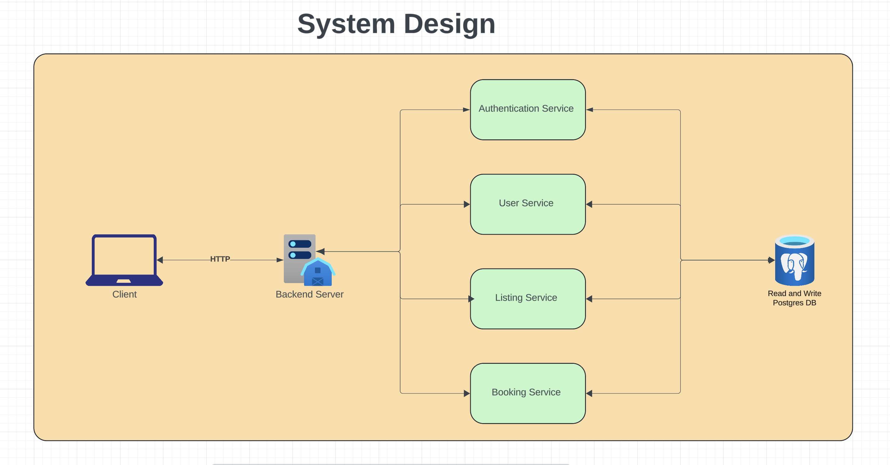
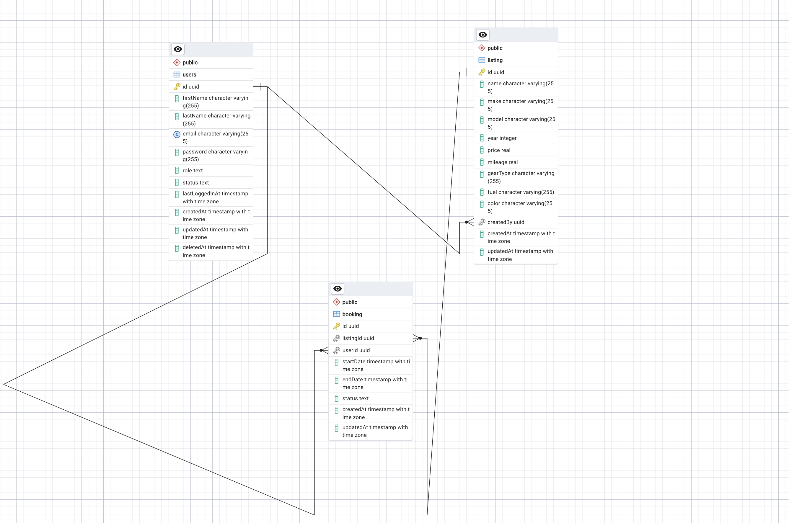

# Vehicle listing

This project is to satisfy vehicle listing, the project is a Car Listing Marketplace API built with Node.js, Express, and PostgreSQL. It allows users to browse car listings, make bookings, and manage their sessions. The API also includes features for superusers to create and manage car listings. you can access the deployed application here https://given-jeniffer-bolu1-dd997090.koyeb.app and the documentation can be accessed here https://documenter.getpostman.com/view/18378761/2s9Ykt3yAj

## Features

- User registration and authentication.
- Car listing creation and management (Superuser only).
- Car search functionality with filtering by make, model, price, year, mileage, etc.
- Car booking and cancellation (with restrictions).
- Session management.

## Prerequisites

- Node.js (>=14.x)
- PostgreSQL (>=12.x)
- npm (or yarn)
- Docker (optional, for running the app with Docker)

## Getting Started

### Clone the repository

```bash
git clone https://github.com/Bolu1/vehicle-marketplace-backend
cd vehicle-marketplace-backend
```

### Install dependencies

```bash
npm install
```

### Set up environment variables

Create a `.env` file in the root of your project and add the following variables:

```plaintext
SERVER_ENVIRONMENT=DEVELOPMENT
SERVER_PORT=8000
DATABASE_HOST=localhost
DATABASE_USERNAME=postgres
DATABASE_NAME=vehicle-listing-backend-backend-db
DATABASE_PASSWORD=password
DATABASE_PORT=5432
JWT_SECRET_KEY=something_secret
BCRYPT_HASHING_SALT=12
```

### Set up the database

1. Make sure PostgreSQL is installed and running on your machine.
2. Create a new database:

```bash
psql -U your_postgres_username
CREATE DATABASE vehicle-listing-backend-backend-db;
```

3. Run migrations to set up the database schema:

```bash
npm run migrate:dev:run
```

### Run the application

```bash
npm run start:dev
```

The server will start on the port specified in the `.env` file (default is 8000).

### Running the Application with Docker

If you prefer to run the application using Docker, follow these steps:

1. **Build and Run the Docker Containers**

   Make sure you have Docker and Docker Compose installed. Then, use the following commands:

   ```bash
   docker build -t vehicle-listing-backend-backend-db .
   docker run -d -p 8000:8000 --name vehicle-listing-backend --env-file .env vehicle-listing-backend-backend-db
   ```

   This will start both the application and a PostgreSQL database in Docker containers.

2. **Access the Application**

   The server will be running at `http://localhost:8000`.

3. **Running Migrations**

   If you need to run database migrations, you can do so by modifying the `command` in the `docker-compose.yml` file or running the migrations manually inside the Docker container:

   ```bash
   docker-compose exec app npm run migrate:dev:run
   ```

4. **Stopping the Containers**

   To stop the running containers, use:

   ```bash
   docker-compose down
   ```

## System Design

The system is designed to be scalable and maintainable, with a focus on modularity and separation of concerns. Below is a high-level overview of the system architecture.



## ERD Diagram

The Entity-Relationship Diagram (ERD) provides a visual representation of the database structure, showing the relationships between the various entities involved in the application.



## Running Tests

To run tests, use the following command:

```bash
npm run test
```

## License

This project is open-source and available under the [MIT License](LICENSE).
